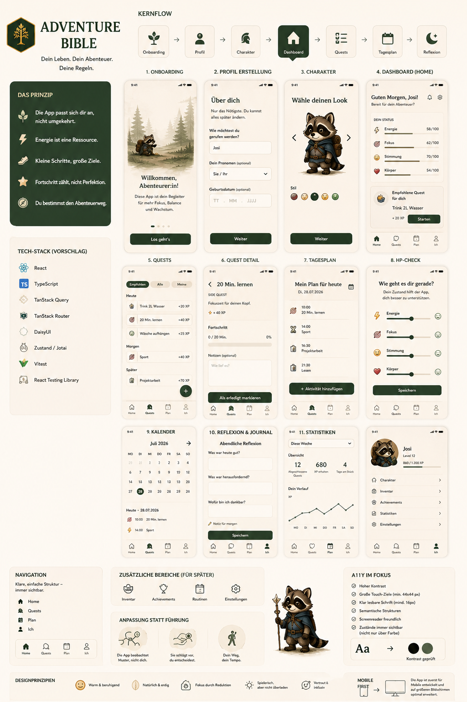

# 🧭 Adventure Bible Frontend

> Dein Alltag wird zum Abenteuer.

Das Frontend ist die mobile-first React-App von Adventure Bible. Es zeigt den Produktflow: Onboarding, Profil, HP-Check, passende Quests, Plan, Reflexion, Kalender und Fortschritt.



## ✨ Auf Einen Blick

| Bereich | Stand |
|---|---|
| App-Typ | Mobile-first React-App |
| MVP | Gemeinsamer Frontend-Backend-MVP |
| Authentifizierung | Clerk UI für Anmeldung und Nutzerkonto |
| HP-Bereiche | Energie, Fokus, Stimmung, Körper |
| Persistenz | Profil, große und kleine HP-Checks, Quests/QuestLogs und Reflexion mit Backend-Anbindung; einzelne Bereiche noch lokal |
| Langfristig | PWA für kleinen Freundeskreis |

## 🌿 Produktidee

Adventure Bible soll sich wie eine ruhige Begleitung anfühlen. Der Nutzer soll nicht gegen eine starre Aufgabenliste arbeiten, sondern aus seinem aktuellen Zustand heraus einen machbaren nächsten Schritt finden.

Der Leitgedanke:

> Die App passt sich an den Nutzer an, nicht umgekehrt.

## 🎯 MVP-Scope

Der MVP ist ab jetzt ein gemeinsamer Frontend-Backend-MVP. Das Frontend soll die nötigen Daten nicht nur lokal halten, sondern über das Backend speichern und wieder laden.

| Gehört zum Frontend-MVP | Später |
|---|---|
| abgespecktes Onboarding | ausführliche Charakter-Erstellung |
| Clerk-Konto für Authentifizierung und Verifizierung | Inventar |
| Anzeigename und Pronomen | Routinen |
| Profil mit XP, Level und Quest Points | erweiterte Statistiken |
| vier HP-Bereiche | KI-Unterstützung |
| großer HP-Check und Mini HP-Check | App-Store-Veröffentlichung |
| Dashboard/Home mit aktuellem Status |  |
| adaptive Quest-Auswahl |  |
| Quests starten und abschließen |  |
| XP, Quest Points und Achievements |  |
| Tagesplan, Kalender, Reflexion und Journal |  |

## 🧩 Projektstatus

| Umgesetzt | Offen |
|---|---|
| App-Shell und Navigation | PWA-Check für Installierbarkeit |
| Dashboard/Home | finale manuelle Accessibility-Abnahme |
| großer HP-Check mit Backend-Persistenz | JournalEntries aus dem Backend wieder in den Kalender laden |
| Mini HP-Check mit Backend-Persistenz | finale manuelle Accessibility-Abnahme |
| Quest-Flow mit Backend-QuestLogs | vollständige Persistenz aller MVP-Daten prüfen |
| Plan und Kalender mit Backend-PlanActivities, Reflexion mit Backend-JournalEntry | PWA-Check für Installierbarkeit |
| Profilbereich | Profil-Löschung erst später |
| Achievements |  |
| Clerk UI |  |
| Backend-Anbindung für Profil, HP-Checks, Quests/QuestLogs, Reflexion und Plan/Kalender |  |

Zieltermin für die vollständige Frontend-Backend-Version und Abgabe: 19.10.2026.

## 🚀 Langfristige App-Vision

Adventure Bible soll langfristig wie eine echte App nutzbar sein, aber zuerst als PWA statt über App Store oder Play Store.

Ziel:

- installierbare Website mit App-Icon
- Nutzung durch kleinen Freundeskreis
- kostenfrei für Nutzer
- möglichst keine laufenden Kosten für die Entwicklerin
- später mehr RPG-Elemente wie Charakter-Erstellung, Inventar und Routinen

## 🛠️ Tech Stack

| Technologie | Verwendung |
|---|---|
| React | UI und Komponenten |
| TypeScript | Typisierung und Domain-Logik |
| Vite | Entwicklungsserver und Build |
| TanStack Router | Routing |
| Tailwind CSS | Styling |
| DaisyUI | UI-Basis |
| Clerk | Authentifizierungs-UI |
| Vitest | Tests |
| ESLint | Codequalität |

## 📁 Projektstruktur

```text
frontend/
├── public/
├── src/
│   ├── components/
│   ├── data/
│   ├── features/
│   │   ├── calendar/
│   │   ├── hpCheck/
│   │   ├── plan/
│   │   ├── profile/
│   │   └── quests/
│   ├── lib/
│   ├── routes/
│   ├── types/
│   └── main.tsx
├── tests/
├── LayoutIdee.png
├── package.json
└── README.md
```

## 💻 Lokale Entwicklung

Dependencies installieren:

```bash
npm install
```

Private `.env` aus Beispiel anlegen:

```bash
cp .env.example .env
```

Benötigte Variablen:

```env
VITE_CLERK_PUBLISHABLE_KEY=pk_test_dein_clerk_publishable_key
VITE_API_BASE_URL=http://localhost:3000
```

Entwicklungsserver starten:

```bash
npm run dev
```

Die App ist lokal standardmäßig unter `http://localhost:5173` erreichbar.

## 🧪 Tests und Qualität

```bash
npm test
npm run lint
npm run build
npm run preview
```

## 🔐 Authentifizierung und Daten

Clerk übernimmt im Frontend die Authentifizierungs-UI. Das Frontend sendet für angebundene API-Aufrufe einen Clerk-Session-Token an das Backend. Der Entwicklungsheader `x-test-auth-user-id` bleibt nur als lokaler Testweg außerhalb von Production erhalten.

Sensible Werte gehören nur in `.env`-Dateien und nicht ins Repository.

## ♿ Accessibility und UX

Adventure Bible soll ruhig, verständlich und mobile-first bleiben.

| Prinzip | Bedeutung |
|---|---|
| klare nächste Handlung | Die App zeigt immer, was als nächstes sinnvoll ist. |
| sichtbare Zustände | Status wird nicht nur über Farbe vermittelt. |
| gute Bedienbarkeit | Touch-Ziele, Fokus und Labels bleiben verständlich. |
| mobile-first | Desktop darf mehr Platz nutzen, aber die App bleibt app-artig. |
| kein Mockup-Umbau für Inhaltsprobleme | Das Handy-Mockup bleibt die Standardgröße. |

## 📚 Dokumentation

| Dokument | Zweck |
|---|---|
| [Produktvision](../docs/PROJECT.md) | Grundidee und Prinzipien |
| [Features](../docs/FEATURES.md) | MVP und spätere Funktionen |
| [Design](../docs/DESIGN.md) | Gestaltung und UX |
| [Accessibility](../docs/ACCESSIBILITY.md) | Barrierefreiheit |
| [Architektur](../docs/ARCHITECTURE.md) | Frontend-Aufbau |
| [Security](../docs/SECURITY.md) | Sicherheitsregeln |
| [Roadmap](../docs/ROADMAP.md) | Entwicklungsstand |
| [Development Log](../docs/DEVELOPMENT_LOG.md) | Arbeitsnotizen |
